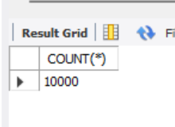
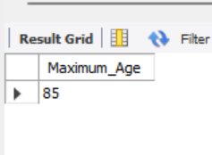
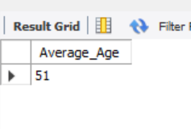

# Analysing Healthcare Dataset using SQL

- SELECT COUNT(*) FROM Healthcare;
   
  
- select max(age) as Maximum_Age from Healthcare;
-  

- Select round(avg(age),0) as Average_Age from Healthcare;
      

