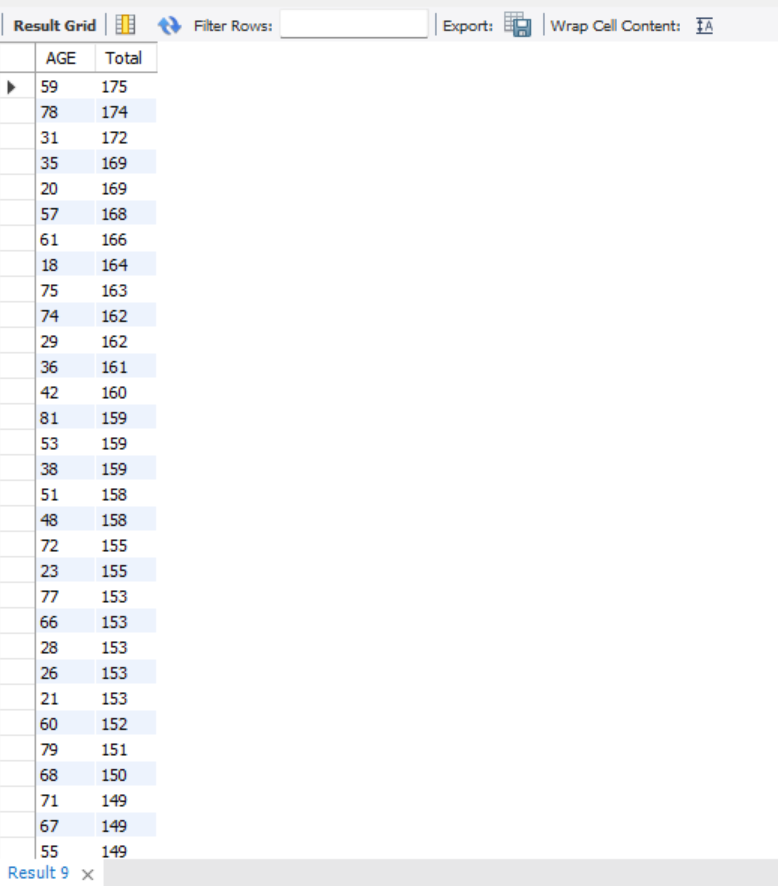

# Analysing Healthcare Dataset using SQL

- SELECT COUNT(*) FROM Healthcare;
   
  
- select max(age) as Maximum_Age from Healthcare;
  

- Select round(avg(age),0) as Average_Age from Healthcare;
   

- SELECT AGE, COUNT(AGE) AS Total
FROM Healthcare
GROUP BY age
ORDER BY AGE DESC;

- SELECT AGE, COUNT(AGE) AS Total
FROM Healthcare
GROUP BY age
ORDER BY Total DESC,age DESC;

